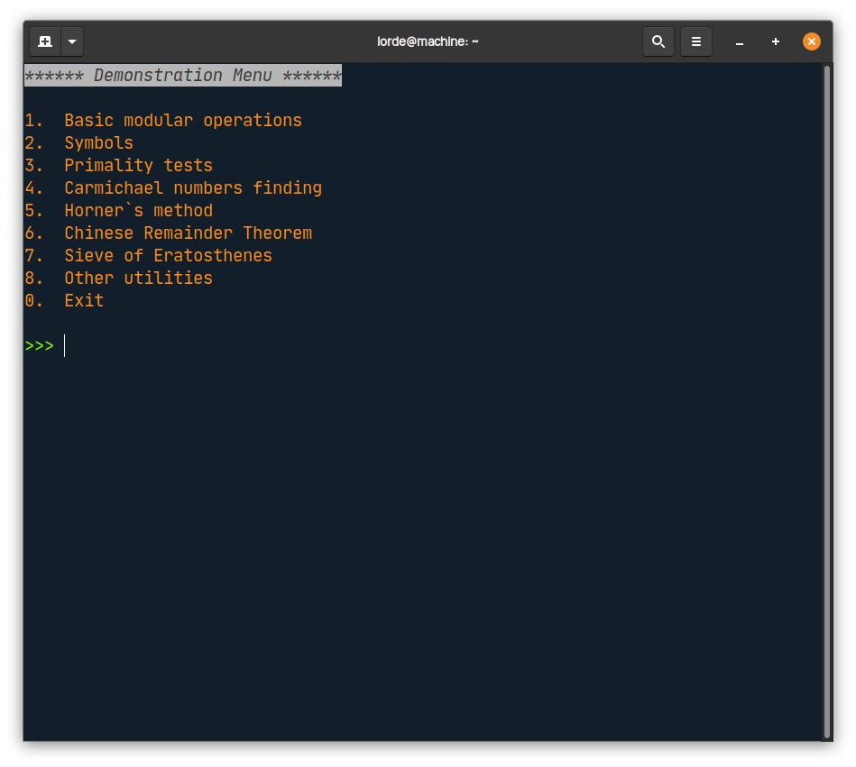
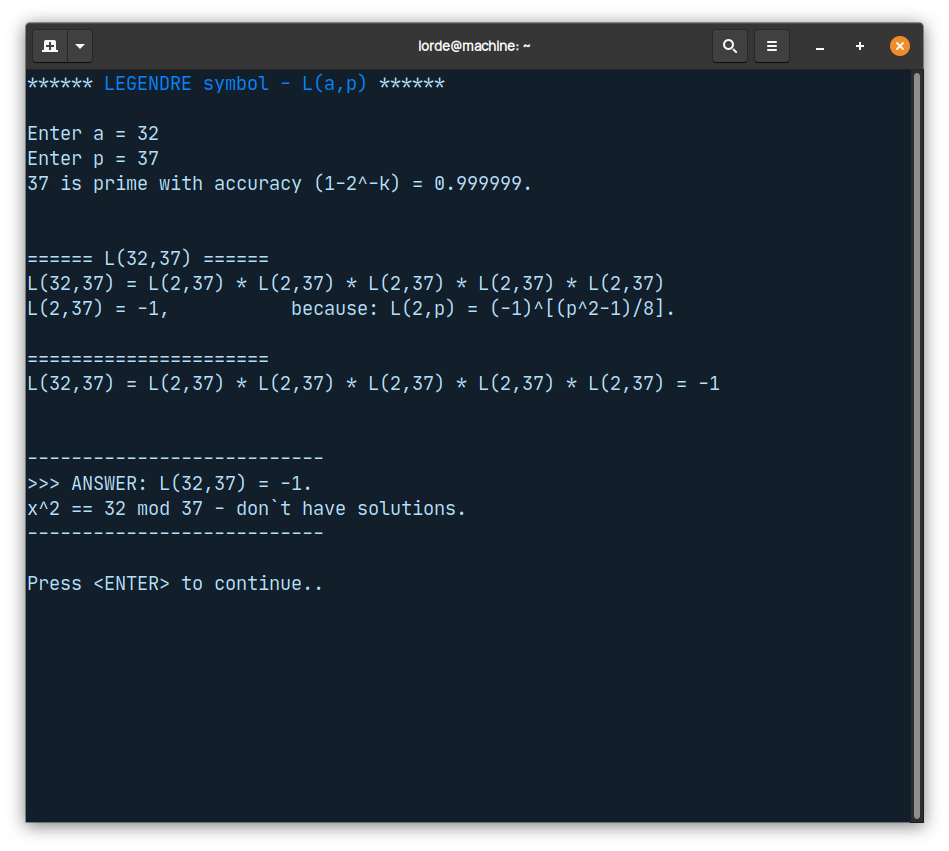
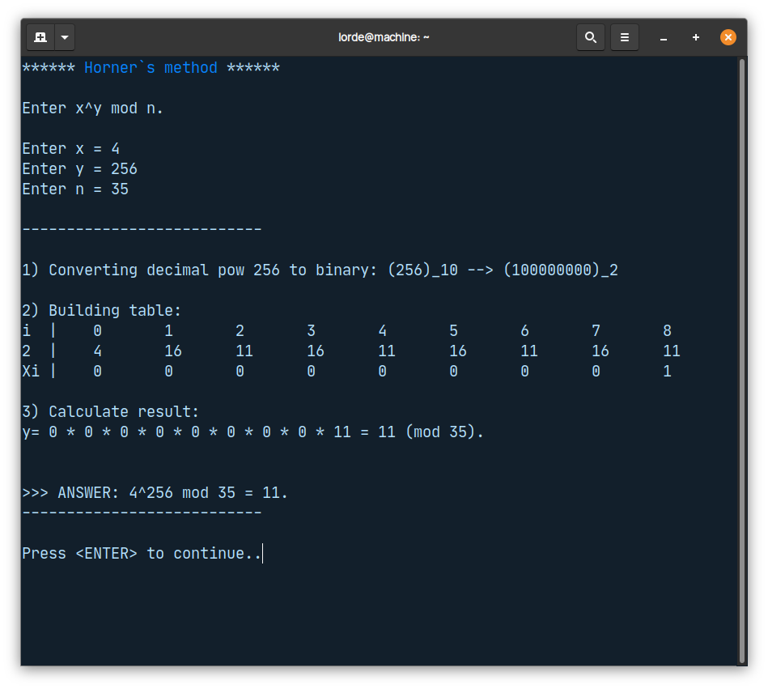
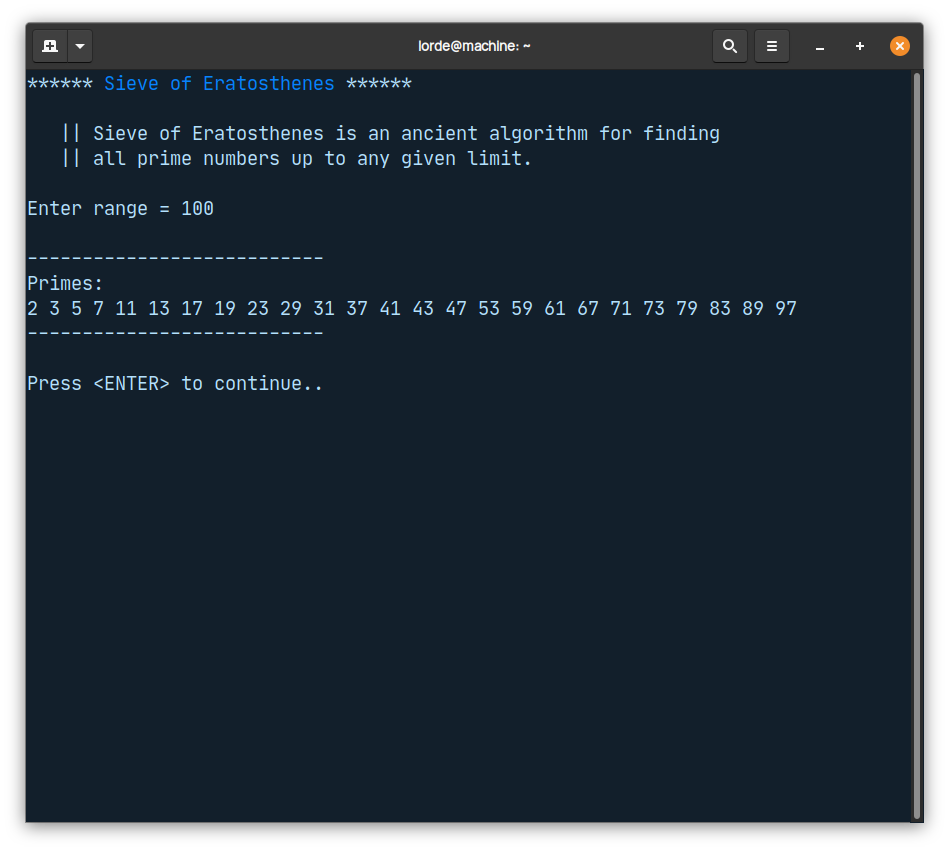
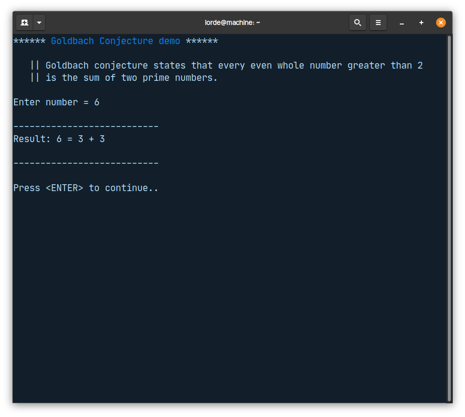
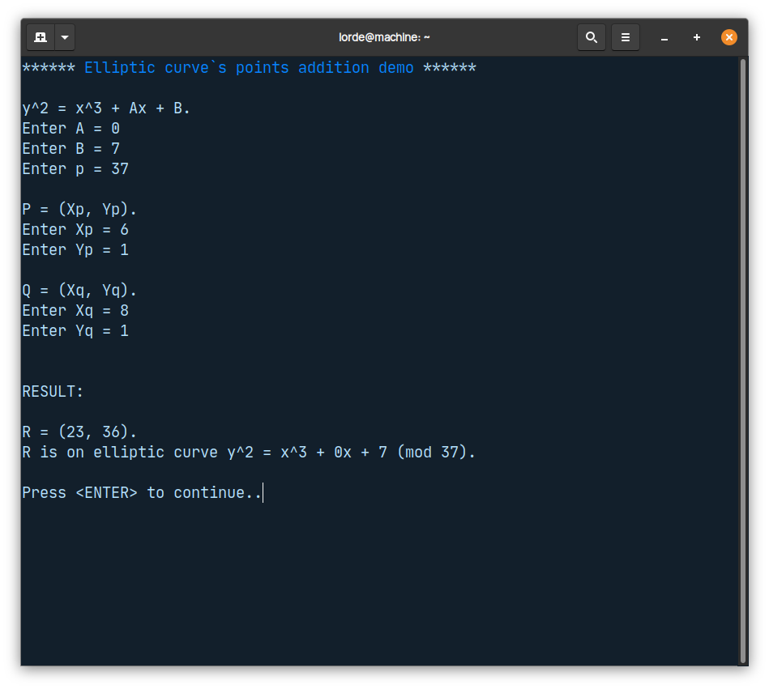

# crypto

**crypto**  - console application that has implementations of various cryptographic's math algorithms. Written in pure C++ using CMake build system.

## Build

### Prerequisites

1.  CMake.
2.  CLion.

### Installation

1.  Clone repository.
2.  Open project via CLion.
3.  Build project (`Ctrl-F9`).
4.  Navigate to *cmake-build-debug/* and execute `./crypto`.

## List of implemented algorithms

- Modular arithmetic operations;
- Symbols:
    - *Legendre*,
    - *Jacobi*.
- Primality tests:
    - *Solovay-Strassen*,
    - *Fermat*,
    - *Lehmann*.
- Carmichael numbers finding;
- Horner's method;
- Chinese Remainder Theorem (for 2 equations);
- Sieve of Eratosthenes;
- Conjectures:
    - *Goldbach*,
    - *Legendre*.
- Prime probability on range;
- Elliptic curves's points addition.

## Screenshots

